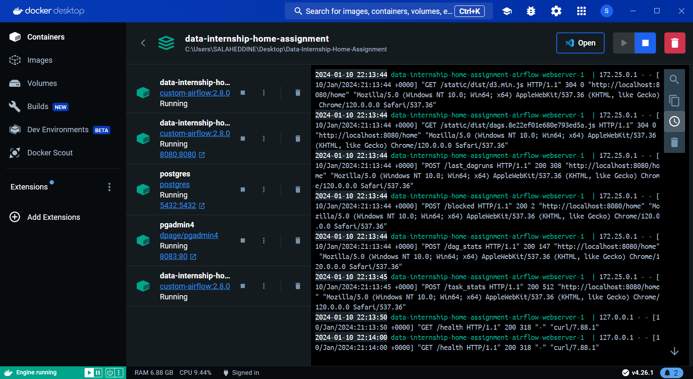
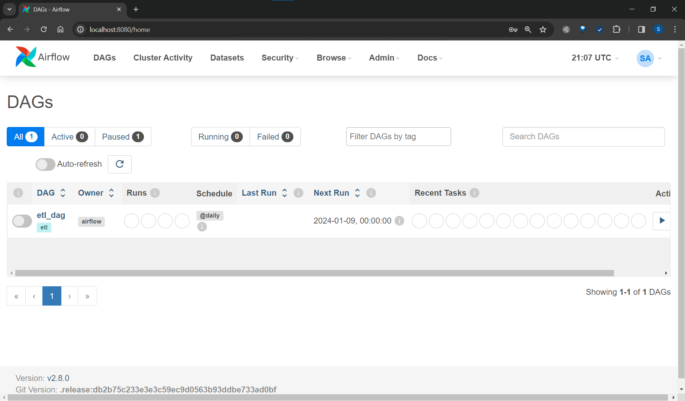
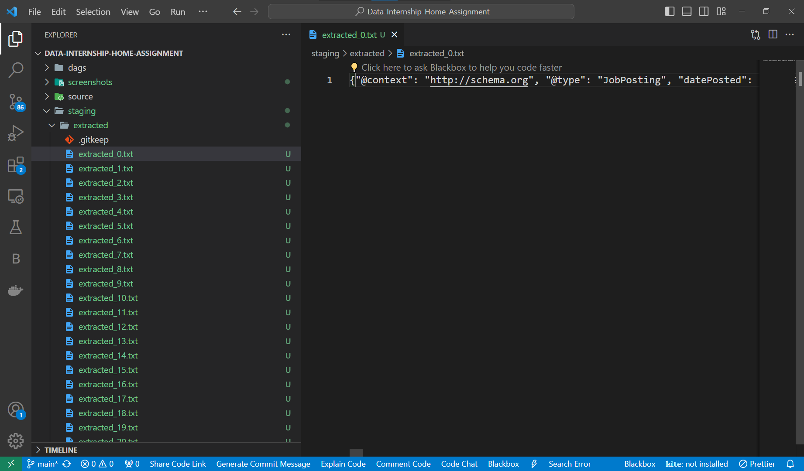
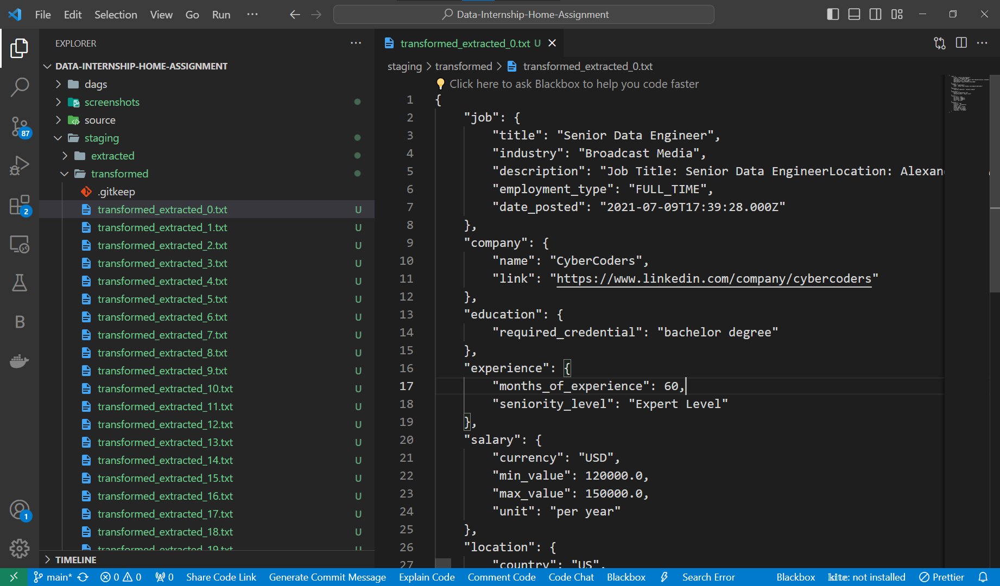
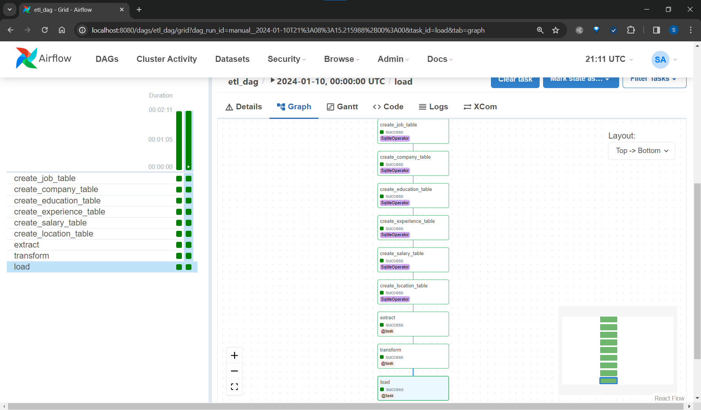

# DNA Engineering Data Assignment

Build an ETL pipeline using Apache Airflow.

## Description

- You are invited to build an ETL pipline using Ariflow in this assignment.
- Data Location: `source/jobs.csv`

## Airflow

I run airflow on a docker container

<table align="center">
  <tr>
    <th>Run container</th>
    <th>airflow</th>
  </tr>
  <tr>
    <td></td>
    <td></td>
  </tr>
</table>
<br>

## Assignment

### 1. Code Refactoring

For the refactoring, I create a package in dags to develop all the ETL function and create an artist file to put all the necessary variables.

This is the project structure :

```
DATA-INTERNSHIP-HOME-ASSIGNMENT

  |__ dags
        |__ etl.py
        |__ packages
            |__ extract.py
            |__ load.py
            |__ transform.py
            |__ utils.py
        |__ staging
            |__ extracted
            |__ transformed
        |__ tests
            |__ extract_test.py
            |__ transform_test.py
            |__ load_test.py
        |__ docker-compose.yml
        |__ DockerFile
        |__ README.md
        |__ requirements.txt
```

### 2. ETL Tasks

#### Extract job

Read the Dataframe from `source/jobs.csv`, extract the context column data, and save each item to `staging/extracted` as a text file.

<div align="center">
  
</div>

#### Transform job

Read the extracted text files from `staging/extracted` as json, clean the job description, transform the schema, and save each item to `staging/transformed` as json file.

<div align="center">
  
</div>

Example of Transformed file :

```json
{
  "job": {
    "title": "Senior Data Engineer",
    "industry": "Broadcast Media",
    "description": "Job Title: Senior Data EngineerLocation: Alexandria, VASalary Range: $120k - $150kRequirements: ETL/ELT, SQL, AWS/Google Cloud, Linux/Unix, Spark (preferred), NoSQL (preferred), Machine Learning concepts (preferred)Based in beautiful Alexandria, VA, we are one of the hottest media analytics and software start-ups in the DC area. Due to growth, we are actively seeking to hire a Senior Data Engineer to join our team. The ideal candidate will have at least 5 years of experience with data pipelines (built with Python), ETL experience, a strong SQL background, experience with AWS or Google Cloud, and strong Unix/Linux fundamentals. Any experience with Spark, NoSQL, and Machine Learning would be a huge plus. If this sounds like you, please apply now or send your resume to shiv.warrier@cybercoders.com!What You Will Be DoingLead design and development of data pipelinesDeliver features on a cadence within an agile frameworkContribute to the definition of user storiesCollaborate with other members of the team, including offshore, on development integrationWrite unit tests and maintain high code quality, per both static code analysis team standardsBe available on a rotating schedule for production issuesWhat You Need for this PositionMust-HaveBS in Computer Science or equivalent5+ years of experience in software/data engineeringExpertise in ETL/ELT techniquesExpertise in SQLExperience working with AWS or Google CloudStrong Unix/Linux fundamentalsNice To HaveExperience with data processing frameworks e.g. SparkExperience with NoSQL column-store databasesExposure to machine learning conceptsExposure to ad tech concepts terminologyWhat's In It for YouCompetitive salary with high bonus potentialCollaborative and creative atmosphere, with inspired leadershipCareer advancement opportunitiesRecognition and reward for outstanding performanceGreat medical, dental; vision Insurance packagesCompetitive 401K with company match to plan for the long termUnlimited paid-time-offTransportation benefits, cell phone reimbursementCasual dress all day, every daySo, if you are a Senior Data Engineer with experience, please apply today!Email Your Resume In Word ToLooking forward to receiving your resume through our website and going over the position with you. Clicking apply is the best way to apply, but you may also:Shiv.Warrier@CyberCoders.comPlease do NOT change the email subject line in any way. You must keep the JobID: linkedin : SW3-1634173 -- in the email subject line for your application to be considered.***Shiv Warrier - Sr. Executive Recruiter - CyberCodersApplicants must be authorized to work in the U.S.CyberCoders, Inc is proud to be an Equal Opportunity EmployerAll qualified applicants will receive consideration for employment without regard to race, color, religion, sex, national origin, disability, protected veteran status, or any other characteristic protected by law.Your Right to Work - In compliance with federal law, all persons hired will be required to verify identity and eligibility to work in the United States and to complete the required employment eligibility verification document form upon hire.",
    "employment_type": "FULL_TIME",
    "date_posted": "2021-07-09T17:39:28.000Z"
  },
  "company": {
    "name": "CyberCoders",
    "link": "https://www.linkedin.com/company/cybercoders"
  },
  "education": {
    "required_credential": "bachelor degree"
  },
  "experience": {
    "months_of_experience": 60,
    "seniority_level": "Expert Level"
  },
  "salary": {
    "currency": "USD",
    "min_value": 120000.0,
    "max_value": 150000.0,
    "unit": "per year"
  },
  "location": {
    "country": "US",
    "locality": "Alexandria",
    "region": "VA",
    "postal_code": "22336",
    "street_address": null,
    "latitude": "38.804665",
    "longitude": "-77.04362"
  }
}
```

#### Load job

Read the transformed data from `staging/transformed`, and save it to the sqlite database.

All the tasks run successfully

<div align="center">
  
</div>
